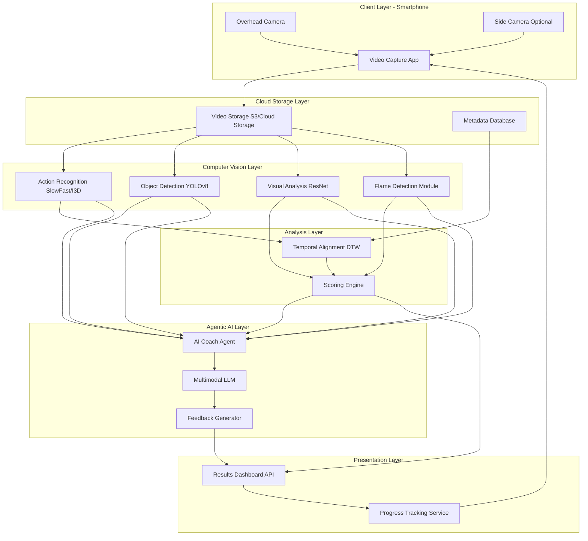
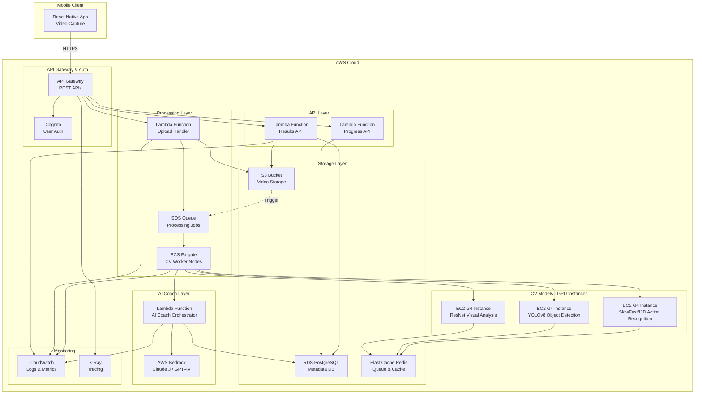

# Design Document: BharatChef AI Coach

## Overview

BharatChef AI Coach is a multimodal AI-powered cooking skill evaluation platform that combines computer vision, temporal analysis, and agentic AI coaching to provide objective skill assessment and personalized feedback. The system processes cooking videos through multiple CV models (SlowFast/I3D for action recognition, YOLOv8 for object/ingredient detection, ResNet for visual similarity), aligns trainee performance with expert benchmarks using Dynamic Time Warping, and employs an intelligent AI Coach agent powered by multimodal LLMs to interpret CV outputs and generate human-like coaching feedback.

The MVP architecture is designed for cloud-based processing with smartphone video capture, targeting low-cost deployment (<₹2 per evaluation) while maintaining high accuracy (≥85% action recognition, ≥80% ingredient detection).

## Architecture

### System Architecture Diagram

#### High-Level Architecture Flow



#### AWS Cloud Architecture



#### AWS Services Breakdown

**Compute**:
- **API Gateway**: REST API endpoints for mobile app
- **Lambda Functions**: Serverless handlers for upload, AI coach, and results APIs
- **ECS Fargate**: Container orchestration for CV processing workers
- **EC2 G4 Instances**: GPU instances for CV model inference (SlowFast, YOLOv8, ResNet)

**Storage**:
- **S3**: Video file storage with lifecycle policies
- **RDS PostgreSQL**: Metadata, scores, and evaluation results
- **ElastiCache Redis**: Job queue and caching layer

**AI/ML**:
- **AWS Bedrock**: Managed LLM service (Claude 3, GPT-4V) for AI Coach
- **SageMaker** (optional): Model hosting alternative for CV models

**Security & Auth**:
- **Cognito**: User authentication and authorization
- **IAM**: Service-to-service permissions
- **KMS**: Encryption key management

**Monitoring**:
- **CloudWatch**: Logs, metrics, and alarms
- **X-Ray**: Distributed tracing for debugging

**Messaging**:
- **SQS**: Asynchronous job queue for video processing

### Architecture Layers

1. **Client Layer**: Smartphone-based video capture with overhead and optional side camera support
2. **Cloud Storage Layer**: Scalable video storage and metadata management
3. **Computer Vision Layer**: Multiple specialized CV models for different analysis tasks
4. **Analysis Layer**: Temporal alignment and scoring logic
5. **Agentic AI Layer**: Intelligent coaching agent with multimodal LLM
6. **Presentation Layer**: Dashboard and progress tracking APIs

### Key Design Decisions

**Cloud-First Processing**: All CV model inference runs in the cloud to support low-cost Android devices without requiring specialized hardware. This enables scalability and cost optimization through batch processing and model quantization.

**Modular CV Pipeline**: Separate specialized models (SlowFast/I3D, YOLOv8, ResNet) rather than a single monolithic model. This allows independent optimization, easier debugging, and flexibility to swap models.

**Agentic AI Coach**: Rather than rule-based feedback, use a multimodal LLM-powered agent that interprets CV outputs contextually and generates human-like coaching. This provides more nuanced, encouraging, and actionable feedback.

**DTW for Temporal Alignment**: Dynamic Time Warping handles variable cooking speeds and allows robust comparison even when trainee timing differs from expert timing.

**Explainable Scoring**: Weighted category scores with transparent logic ensure trainees understand how scores are calculated and where to improve.

## Components and Interfaces

### 1. Video Capture Module

**Responsibility**: Capture cooking videos from smartphone cameras and upload to cloud storage.

**Interfaces**:
```typescript
interface VideoCapture {
  startRecording(cameraType: 'overhead' | 'side'): RecordingSession
  stopRecording(session: RecordingSession): LocalVideo
  uploadVideo(video: LocalVideo, dishId: string): Promise<VideoUploadResult>
  resumeUpload(uploadId: string): Promise<VideoUploadResult>
}

interface RecordingSession {
  sessionId: string
  startTime: Date
  duration: number
  storageUsed: number
}

interface LocalVideo {
  filePath: string
  format: 'mp4' | 'mov' | 'avi'
  duration: number
  fileSize: number
}

interface VideoUploadResult {
  videoId: string
  uploadStatus: 'success' | 'failed' | 'paused'
  cloudUrl: string
}
```

**Key Behaviors**:
- Real-time recording indicators (duration, storage)
- Resumable uploads on network interruption
- Format and duration validation before upload
- Support for both overhead and optional side camera

### 2. Dish Metadata Service

**Responsibility**: Manage dish definitions, expert videos, and expected cooking steps.

**Interfaces**:
```typescript
interface DishMetadataService {
  createDish(metadata: DishMetadata): Promise<string>
  associateExpertVideo(dishId: string, videoId: string): Promise<void>
  getDish(dishId: string): Promise<DishWithExpert>
  listDishes(): Promise<DishSummary[]>
  validateExpertVideo(videoId: string, expectedSteps: string[]): Promise<ValidationResult>
}

interface DishMetadata {
  name: string
  expectedDuration: number
  ingredients: Ingredient[]
  expectedSteps: CookingStep[]
}

interface Ingredient {
  name: string
  quantity: string
  category: 'vegetable' | 'protein' | 'spice' | 'liquid' | 'other'
}

interface CookingStep {
  stepNumber: number
  action: string
  description: string
  expectedDuration: number
}

interface DishWithExpert {
  dishId: string
  metadata: DishMetadata
  expertVideoId: string
  expertVideoUrl: string
}
```

### 3. Action Recognition Module

**Responsibility**: Detect cooking actions in video frames using SlowFast or I3D models.

**Interfaces**:
```typescript
interface ActionRecognitionModule {
  processVideo(videoId: string): Promise<ActionSequence>
  detectActions(videoFrames: VideoFrame[]): Promise<DetectedAction[]>
}

interface VideoFrame {
  frameNumber: number
  timestamp: number
  imageData: Buffer
}

interface DetectedAction {
  actionType: 'chopping' | 'stirring' | 'flipping' | 'pouring' | 'plating' | 'other'
  startTimestamp: number
  endTimestamp: number
  confidence: number
  boundingBox?: BoundingBox
}

interface ActionSequence {
  videoId: string
  actions: DetectedAction[]
  processingTime: number
  modelVersion: string
}

interface BoundingBox {
  x: number
  y: number
  width: number
  height: number
}
```

**Implementation Notes**:
- Use SlowFast or I3D pre-trained models fine-tuned on cooking action datasets
- Process video at 8-16 FPS for efficiency
- Target ≥85% accuracy on validation set
- Return confidence scores for quality filtering

### 4. Object and Ingredient Detection Module

**Responsibility**: Detect ingredients and utensils using YOLOv8 object detection.

**Interfaces**:
```typescript
interface ObjectDetectionModule {
  detectObjects(videoId: string): Promise<ObjectDetectionResult>
  detectInFrame(frame: VideoFrame): Promise<DetectedObject[]>
  generateIngredientReport(detected: DetectedObject[], expected: Ingredient[]): IngredientReport
}

interface DetectedObject {
  objectType: 'ingredient' | 'utensil'
  objectName: string
  timestamp: number
  boundingBox: BoundingBox
  confidence: number
}

interface ObjectDetectionResult {
  videoId: string
  detectedObjects: DetectedObject[]
  uniqueIngredients: string[]
  uniqueUtensils: string[]
}

interface IngredientReport {
  expectedIngredients: string[]
  detectedIngredients: string[]
  missingIngredients: string[]
  extraIngredients: string[]
  accuracy: number
}
```

**Implementation Notes**:
- Use YOLOv8 model fine-tuned on cooking ingredients and utensils
- Target ≥80% detection accuracy
- Sample frames at 1-2 FPS for ingredient detection
- Aggregate detections across frames to build ingredient list

### 5. Heat and Flame Analysis Module

**Responsibility**: Analyze flame and heat control using brightness spectrum analysis.

**Interfaces**:
```typescript
interface FlameAnalysisModule {
  analyzeFlame(videoId: string, cameraType: 'overhead' | 'side'): Promise<FlameAnalysisResult>
  detectFlameInFrame(frame: VideoFrame): FlameDetection
  estimateHeatIntensity(frames: VideoFrame[]): HeatIntensity[]
}

interface FlameDetection {
  flamePresent: boolean
  flameLevel: 'low' | 'medium' | 'high' | 'none'
  brightness: number
  colorSpectrum: number[]
  timestamp: number
}

interface HeatIntensity {
  timestamp: number
  intensity: 'low' | 'medium' | 'high'
  visualCues: ('steam' | 'bubbling' | 'color_change')[]
  confidence: number
}

interface FlameAnalysisResult {
  videoId: string
  flameDetections: FlameDetection[]
  heatIntensities: HeatIntensity[]
  heatControlScore: number
}
```

**Implementation Notes**:
- Analyze brightness in HSV color space for flame detection
- Look for orange/yellow spectrum (flame colors) in bright regions
- Detect steam, bubbling, and browning as heat indicators
- Compare temporal patterns with expert video

### 6. Temporal Alignment Module

**Responsibility**: Align trainee and expert action sequences using Dynamic Time Warping.

**Interfaces**:
```typescript
interface TemporalAlignmentModule {
  alignSequences(traineeSeq: ActionSequence, expertSeq: ActionSequence): AlignmentResult
  calculateDTW(seq1: number[], seq2: number[]): DTWResult
  identifyDeviations(alignment: AlignmentResult): StepDeviation[]
}

interface AlignmentResult {
  traineeVideoId: string
  expertVideoId: string
  alignmentPath: AlignmentPair[]
  totalDistance: number
  stepSequenceAccuracy: number
}

interface AlignmentPair {
  traineeIndex: number
  expertIndex: number
  timeDifference: number
}

interface DTWResult {
  distance: number
  path: [number, number][]
  costMatrix: number[][]
}

interface StepDeviation {
  deviationType: 'missing' | 'extra' | 'out_of_order' | 'timing'
  stepDescription: string
  expectedTimestamp?: number
  actualTimestamp?: number
  impact: 'high' | 'medium' | 'low'
}
```

**Implementation Notes**:
- Use DTW with cosine distance on action embeddings
- Allow flexible time warping to handle speed variations
- Identify missing, extra, and out-of-order steps
- Calculate timing differences for aligned steps

### 7. Visual Quality Analysis Module

**Responsibility**: Compare visual appearance of trainee and expert dishes using ResNet embeddings.

**Interfaces**:
```typescript
interface VisualAnalysisModule {
  analyzeVisualQuality(traineeVideoId: string, expertVideoId: string): Promise<VisualAnalysisResult>
  extractEmbedding(frame: VideoFrame): Promise<number[]>
  calculateSimilarity(embedding1: number[], embedding2: number[]): number
  analyzeColorTexture(frame: VideoFrame): ColorTextureAnalysis
}

interface VisualAnalysisResult {
  traineeVideoId: string
  expertVideoId: string
  similarityScore: number
  colorDifferences: ColorDifference[]
  textureDifferences: string[]
  platingGaps: string[]
}

interface ColorDifference {
  region: string
  expectedColor: RGB
  actualColor: RGB
  difference: number
}

interface RGB {
  r: number
  g: number
  b: number
}

interface ColorTextureAnalysis {
  dominantColors: RGB[]
  colorDistribution: number[]
  textureFeatures: number[]
  platingScore: number
}
```

**Implementation Notes**:
- Use ResNet-50 pre-trained on ImageNet for embeddings
- Extract embeddings from final plating frames
- Calculate cosine similarity between embeddings
- Analyze color histograms and texture patterns
- Identify specific visual differences for feedback

### 8. Scoring Engine

**Responsibility**: Calculate performance scores with explainable weighted aggregation.

**Interfaces**:
```typescript
interface ScoringEngine {
  calculateOverallScore(evaluation: EvaluationData): PerformanceScore
  calculateCategoryScores(evaluation: EvaluationData): CategoryScores
  determineSkillLevel(overallScore: number): SkillLevel
}

interface EvaluationData {
  stepSequenceAccuracy: number
  timingAccuracy: number
  techniqueQuality: number
  heatControlScore: number
  visualSimilarityScore: number
  platingScore: number
}

interface PerformanceScore {
  overallScore: number
  categoryScores: CategoryScores
  skillLevel: SkillLevel
  timestamp: Date
  videoId: string
}

interface CategoryScores {
  stepSequence: number
  timing: number
  technique: number
  heatControl: number
  visualQuality: number
  plating: number
}

type SkillLevel = 'Beginner' | 'Intermediate' | 'Advanced'
```

**Implementation Notes**:
- Weighted aggregation: step sequence (25%), timing (20%), technique (20%), visual quality (20%), heat control (10%), plating (5%)
- All scores normalized to 0-100 scale
- Skill levels: Beginner (0-50), Intermediate (51-75), Advanced (76-100)
- Store scores with timestamps for progression tracking

### 9. AI Coach Agent

**Responsibility**: Interpret CV outputs and generate personalized coaching feedback using multimodal LLM.

**Interfaces**:
```typescript
interface AICoachAgent {
  generateFeedback(coachingInput: CoachingInput): Promise<CoachingFeedback>
  interpretCVOutputs(cvData: CVOutputs): CoachingInsights
  prioritizeMistakes(insights: CoachingInsights): PrioritizedMistake[]
  generateCorrectiveActions(mistake: PrioritizedMistake): string[]
}

interface CoachingInput {
  traineeVideoId: string
  expertVideoId: string
  actionSequence: ActionSequence
  objectDetection: ObjectDetectionResult
  flameAnalysis: FlameAnalysisResult
  visualAnalysis: VisualAnalysisResult
  alignment: AlignmentResult
  scores: PerformanceScore
  videoFrames: VideoFrame[]
}

interface CVOutputs {
  actions: DetectedAction[]
  objects: DetectedObject[]
  flames: FlameDetection[]
  visual: VisualAnalysisResult
  deviations: StepDeviation[]
}

interface CoachingInsights {
  criticalMistakes: Mistake[]
  improvementAreas: string[]
  strengths: string[]
  contextualFactors: string[]
}

interface Mistake {
  category: 'sequence' | 'timing' | 'technique' | 'heat' | 'visual' | 'ingredient'
  description: string
  timestamp: number
  severity: 'high' | 'medium' | 'low'
  impactOnScore: number
}

interface PrioritizedMistake {
  mistake: Mistake
  priority: number
  reasoning: string
}

interface CoachingFeedback {
  overallAssessment: string
  topMistakes: FeedbackItem[]
  correctiveActions: FeedbackItem[]
  encouragement: string
  practiceRecommendations: string[]
}

interface FeedbackItem {
  title: string
  description: string
  impact: string
  suggestedCorrection: string
  timestamp?: number
}
```

**Implementation Notes**:
- Use multimodal LLM (GPT-4V, Claude 3, or Gemini) to analyze video frames and CV outputs
- Provide structured prompt with CV data, scores, and deviations
- Request top 3-5 mistakes with explanations and corrective actions
- Generate encouraging, human-like feedback
- Prioritize mistakes by impact on overall performance
- Include specific timestamps for video reference

### 10. Results Dashboard Service

**Responsibility**: Provide API for displaying evaluation results and progress tracking.

**Interfaces**:
```typescript
interface ResultsDashboardService {
  getEvaluationResults(videoId: string): Promise<EvaluationResults>
  getProgressionData(traineeId: string, dishId: string): Promise<ProgressionData>
  compareVideos(traineeVideoId: string, expertVideoId: string): Promise<VideoComparison>
}

interface EvaluationResults {
  performanceScore: PerformanceScore
  coachingFeedback: CoachingFeedback
  stepDeviationReport: StepDeviation[]
  visualComparison: VisualAnalysisResult
  ingredientReport: IngredientReport
}

interface ProgressionData {
  traineeId: string
  dishId: string
  attempts: AttemptSummary[]
  improvementPercentage: number
  repeatedMistakes: Mistake[]
  skillTrend: 'improving' | 'stable' | 'declining'
}

interface AttemptSummary {
  attemptNumber: number
  videoId: string
  timestamp: Date
  overallScore: number
  categoryScores: CategoryScores
}

interface VideoComparison {
  traineeVideoUrl: string
  expertVideoUrl: string
  syncedTimestamps: SyncPoint[]
  keyDifferences: string[]
}

interface SyncPoint {
  traineeTimestamp: number
  expertTimestamp: number
  description: string
}
```

## Data Models

### Video Entity
```typescript
interface Video {
  videoId: string
  traineeId: string
  dishId: string
  cameraType: 'overhead' | 'side'
  uploadTimestamp: Date
  cloudUrl: string
  format: string
  duration: number
  fileSize: number
  processingStatus: 'pending' | 'processing' | 'completed' | 'failed'
}
```

### Dish Entity
```typescript
interface Dish {
  dishId: string
  name: string
  expectedDuration: number
  ingredients: Ingredient[]
  expectedSteps: CookingStep[]
  expertVideoId: string
  createdAt: Date
  updatedAt: Date
}
```

### Evaluation Entity
```typescript
interface Evaluation {
  evaluationId: string
  traineeVideoId: string
  expertVideoId: string
  traineeId: string
  dishId: string
  performanceScore: PerformanceScore
  coachingFeedback: CoachingFeedback
  actionSequence: ActionSequence
  objectDetection: ObjectDetectionResult
  flameAnalysis: FlameAnalysisResult
  visualAnalysis: VisualAnalysisResult
  alignment: AlignmentResult
  createdAt: Date
}
```

### Trainee Entity
```typescript
interface Trainee {
  traineeId: string
  name: string
  email: string
  skillLevel: SkillLevel
  evaluationHistory: string[]
  createdAt: Date
}
```

## Correctness Properties

*A property is a characteristic or behavior that should hold true across all valid executions of a system—essentially, a formal statement about what the system should do. Properties serve as the bridge between human-readable specifications and machine-verifiable correctness guarantees.*


### Property 1: Video Upload and Retrieval Round Trip

*For any* valid video file (MP4, MOV, or AVI format, 30 seconds to 30 minutes duration), uploading the video and then retrieving it should return a video with the same content and metadata (format, duration, file size).

**Validates: Requirements 1.3, 1.4, 1.6, 1.8, 1.9**

### Property 2: Upload Resumption After Network Interruption

*For any* video upload in progress, if network connectivity is lost and then restored, the upload should resume from the last successful checkpoint without data loss or corruption.

**Validates: Requirements 1.7**

### Property 3: Dish Metadata Association Preservation

*For any* dish and expert video, associating the expert video with the dish and then retrieving the dish should return the same expert video association.

**Validates: Requirements 2.2, 2.4**

### Property 4: Action Detection Completeness

*For any* detected action in a video, the action record must contain all required fields: action type, start timestamp, end timestamp, and confidence score.

**Validates: Requirements 3.3**

### Property 5: Action Sequence Temporal Ordering

*For any* generated action sequence, the actions must be ordered by timestamp, and no action's start timestamp should be greater than its end timestamp.

**Validates: Requirements 3.5**

### Property 6: Object Detection Completeness

*For any* detected object (ingredient or utensil) in a video, the detection record must contain all required fields: object type, object name, timestamp, bounding box coordinates, and confidence score.

**Validates: Requirements 4.5**

### Property 7: Ingredient Report Accuracy

*For any* ingredient detection result and expected ingredient list, the generated ingredient report should correctly identify missing ingredients (expected but not detected) and extra ingredients (detected but not expected), with no ingredient appearing in both lists.

**Validates: Requirements 4.6, 4.7**

### Property 8: Flame Classification Consistency

*For any* detected flame, the flame level classification (low, medium, high, none) should be consistent with the brightness value: higher brightness should not result in lower flame level classification.

**Validates: Requirements 5.3**

### Property 9: Heat Control Score Generation

*For any* flame analysis result (whether from side camera or overhead camera), a heat control score (0-100) must be generated.

**Validates: Requirements 5.6, 5.7**

### Property 10: DTW Alignment Symmetry

*For any* two action sequences, the DTW alignment distance should be symmetric: aligning sequence A to sequence B should produce the same distance as aligning sequence B to sequence A.

**Validates: Requirements 6.1**

### Property 11: Step Deviation Identification

*For any* DTW alignment result, if the alignment identifies a missing step, that step should appear in the expert sequence but not in the trainee sequence at the corresponding aligned position.

**Validates: Requirements 6.2**

### Property 12: Visual Similarity Score Bounds

*For any* two video frames, the calculated cosine similarity between their ResNet embeddings should be a value between 0 and 1 (inclusive), and identical frames should produce a similarity score of 1.0.

**Validates: Requirements 7.2, 7.4**

### Property 13: Performance Score Weighted Aggregation

*For any* evaluation data with category scores, the overall performance score should equal the weighted sum: (step_sequence × 0.25) + (timing × 0.20) + (technique × 0.20) + (visual_quality × 0.20) + (heat_control × 0.10) + (plating × 0.05).

**Validates: Requirements 8.1, 8.3, 8.4**

### Property 14: Skill Level Determination

*For any* overall performance score, the skill level should be: Beginner if score is 0-50, Intermediate if score is 51-75, Advanced if score is 76-100.

**Validates: Requirements 8.6**

### Property 15: Score Persistence with Metadata

*For any* calculated performance score, storing the score and then retrieving it should return the same score value along with the original timestamp and video identifier.

**Validates: Requirements 8.5**

### Property 16: AI Coach Feedback Completeness

*For any* generated coaching feedback, it must contain: top 3-5 identified mistakes, specific corrective actions for each mistake, and structured format with mistake description, impact, and suggested correction.

**Validates: Requirements 9.3, 9.5, 9.8**

### Property 17: Feedback Prioritization by Impact

*For any* set of identified mistakes with different impact scores, the top mistakes in the coaching feedback should be ordered by descending impact on overall performance.

**Validates: Requirements 9.6**

### Property 18: Multi-Attempt Score Storage

*For any* trainee completing multiple attempts for the same dish, all performance scores should be stored with timestamps, and retrieving the attempt history should return all scores in chronological order.

**Validates: Requirements 11.1**

### Property 19: Skill Improvement Calculation

*For any* trainee with at least two attempts for the same dish, the improvement percentage should equal ((latest_score - first_score) / first_score) × 100.

**Validates: Requirements 11.2, 11.6**

### Property 20: Repeated Mistake Identification

*For any* trainee with multiple attempts, if the same mistake category appears in consecutive attempts, it should be identified as a repeated mistake and emphasized in the coaching feedback.

**Validates: Requirements 11.3, 11.4**

### Property 21: Concurrent Video Processing Queue

*For any* set of videos submitted simultaneously by multiple users, each video should be processed exactly once, and no video should be lost or processed multiple times.

**Validates: Requirements 12.4**

### Property 22: Low Confidence Detection Flagging

*For any* action detection with confidence score below 60%, the detection should be flagged as low-confidence in the evaluation report.

**Validates: Requirements 13.2**

### Property 23: Missing Expert Video Evaluation Prevention

*For any* dish without an associated expert video, attempting to evaluate a trainee video for that dish should fail with an error indicating the missing expert video.

**Validates: Requirements 13.4**

### Property 24: Video Validation Error Specificity

*For any* video that fails validation (invalid format, duration out of range, or excessive file size), the error message should specifically indicate which validation rule was violated.

**Validates: Requirements 13.6, 13.7**

### Property 25: Trainee Data Access Authorization

*For any* access request to video or performance data, the system should only return data if the requesting trainee ID matches the trainee ID associated with the data.

**Validates: Requirements 14.3**

### Property 26: Data Deletion Completeness

*For any* trainee data deletion request, all associated videos and performance records should be removed, and subsequent retrieval attempts should return no data for that trainee.

**Validates: Requirements 14.4**

## Error Handling

### Video Upload Errors
- Network interruption: Pause upload, store checkpoint, resume on reconnection
- Invalid format: Reject with specific format error message
- Duration out of range: Reject with duration requirement message
- File size exceeded: Reject with size limit message

### CV Model Errors
- Low confidence detections: Flag in report, continue processing
- Model inference failure: Log error, retry up to 3 times, then fail evaluation with error message
- Missing model weights: Fail fast with configuration error

### Data Errors
- Missing expert video: Prevent evaluation, notify administrator
- Missing dish metadata: Prevent evaluation, return error
- Corrupted video file: Fail evaluation with corruption error message

### AI Coach Errors
- LLM API failure: Retry up to 3 times with exponential backoff
- LLM timeout: Use fallback rule-based feedback generation
- Invalid LLM response format: Parse best-effort, log warning

### Concurrency Errors
- Queue overflow: Return "system busy" error, suggest retry
- Processing timeout: Cancel job, notify user, allow retry
- Duplicate submission: Detect and deduplicate based on video hash

## Testing Strategy

### Dual Testing Approach

The system requires both unit testing and property-based testing for comprehensive coverage:

**Unit Tests**: Focus on specific examples, edge cases, and integration points
- Specific video format validation examples (valid MP4, invalid format)
- Edge cases: 30-second video (minimum), 30-minute video (maximum)
- Error conditions: network failure, missing expert video, corrupted file
- Integration: CV model output parsing, LLM API integration
- Specific dish examples with known expected results

**Property-Based Tests**: Verify universal properties across all inputs
- Minimum 100 iterations per property test (due to randomization)
- Each test tagged with: **Feature: bharatchef-ai-coach, Property {number}: {property_text}**
- Generate random videos, action sequences, scores, and metadata
- Verify properties hold across all generated inputs

### Property-Based Testing Configuration

**Testing Library**: Use `hypothesis` for Python or `fast-check` for TypeScript/JavaScript

**Test Configuration**:
- Minimum 100 iterations per property test
- Shrinking enabled to find minimal failing examples
- Seed-based reproducibility for debugging
- Timeout: 60 seconds per property test

**Property Test Structure**:
```python
# Example property test structure
@given(video=video_strategy(), dish=dish_strategy())
@settings(max_examples=100)
def test_property_1_video_upload_round_trip(video, dish):
    """
    Feature: bharatchef-ai-coach
    Property 1: Video Upload and Retrieval Round Trip
    
    For any valid video file, uploading and retrieving should preserve content.
    """
    # Upload video
    upload_result = video_service.upload(video, dish.id)
    
    # Retrieve video
    retrieved = video_service.get(upload_result.video_id)
    
    # Assert preservation
    assert retrieved.format == video.format
    assert retrieved.duration == video.duration
    assert retrieved.file_size == video.file_size
```

### Test Data Generators

**Video Generator**:
- Random formats: MP4, MOV, AVI
- Random durations: 30 seconds to 30 minutes
- Random file sizes: 10MB to 500MB
- Random camera types: overhead, side

**Action Sequence Generator**:
- Random action types: chopping, stirring, flipping, pouring, plating
- Random timestamps: ordered, non-overlapping
- Random confidence scores: 0.0 to 1.0

**Score Generator**:
- Random category scores: 0 to 100
- Ensure weighted sum matches overall score

**Mistake Generator**:
- Random categories: sequence, timing, technique, heat, visual, ingredient
- Random severities: high, medium, low
- Random impact scores: 0 to 100

### Integration Testing

**End-to-End Flow Tests**:
1. Upload trainee video → Process through CV pipeline → Generate scores → Generate feedback → Display results
2. Multiple attempts → Track progression → Identify repeated mistakes → Emphasize in feedback
3. Network interruption during upload → Resume → Complete successfully

**CV Model Integration Tests**:
- Mock CV model outputs for deterministic testing
- Test with real sample videos for validation
- Verify output format compatibility

**AI Coach Integration Tests**:
- Mock LLM API responses for deterministic testing
- Test with real LLM for validation
- Verify feedback quality and structure

### Performance Testing

**Load Testing**:
- Simulate 100 concurrent video uploads
- Verify queue processing without blocking
- Measure processing time for 10-minute videos (target: <5 minutes)

**Cost Testing**:
- Track cloud compute costs per evaluation
- Verify cost per evaluation <₹2
- Optimize model inference (batch processing, quantization)

## Implementation Notes

### Technology Stack Recommendations

**Backend**:
- Python with FastAPI for REST APIs
- Celery for asynchronous task queue
- PostgreSQL for metadata storage
- Redis for caching and queue management

**CV Models**:
- PyTorch for model inference
- SlowFast or I3D for action recognition (pre-trained, fine-tuned)
- YOLOv8 for object detection (fine-tuned on cooking dataset)
- ResNet-50 for visual embeddings (pre-trained on ImageNet)

**AI Coach**:
- OpenAI GPT-4V, Anthropic Claude 3, or Google Gemini for multimodal LLM
- Structured prompts with CV outputs and video frames
- Fallback to rule-based feedback on LLM failure

**Cloud Infrastructure**:
- AWS S3 or Google Cloud Storage for video storage
- AWS Lambda or Google Cloud Functions for serverless processing
- GPU instances (T4, V100) for CV model inference

**Frontend**:
- React or React Native for mobile app
- Video.js for video playback
- Chart.js for progression visualization

### Deployment Architecture

**MVP Deployment**:
1. Smartphone app captures video, uploads to cloud storage
2. Cloud function triggers on upload, queues processing job
3. Worker processes video through CV pipeline
4. Results stored in database
5. Dashboard API serves results to app

**Scalability Considerations**:
- Horizontal scaling of worker nodes
- Model serving with TensorFlow Serving or TorchServe
- CDN for video delivery
- Database read replicas for dashboard queries

### Security Considerations

- TLS encryption for all data in transit
- Video storage with access controls (IAM policies)
- Authentication and authorization for API endpoints
- Rate limiting to prevent abuse
- Data retention policies (delete after 90 days unless user opts in)

### Cost Optimization

- Model quantization (FP16 or INT8) for faster inference
- Batch processing of multiple videos
- Spot instances for non-critical processing
- Video compression before storage
- Caching of expert video analysis results
